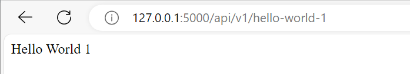

# Мій Flask Проєкт

Це простий Flask проєкт, створений за допомогою Poetry.

## Інструкції по Розгортанню

Щоб розгорнути проєкт, слідувати цим крокам:

1. Склонуйте репозиторій:
   ```bash
   git clone https://github.com/yelyzavetaandrukhova/lab_4_flask.git
   cd lab_4_flask

2. Створіть віртуальне середовище за допомогою Poetry:
   ```bash
   poetry install

3. Активуйте віртуальне середовище:
   ```bash
   poetry shell

4. Запустіть Flask додаток:
   ```bash
   poetry run python app.py

5. Відкрийте свій браузер та перейдіть за адресою http://127.0.0.1:5000/api/v1/hello-world-1, щоб побачити роботу додатку.
6. Приклади Роботи Проєкту
Проєкт має наступні основні можливості:

Адреса '/api/v1/hello-world' повертає текст 'Hello World 1' з HTTP статус кодом 200.
